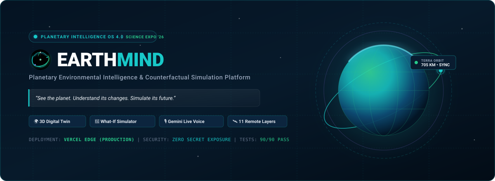
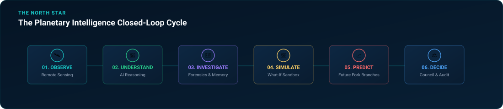
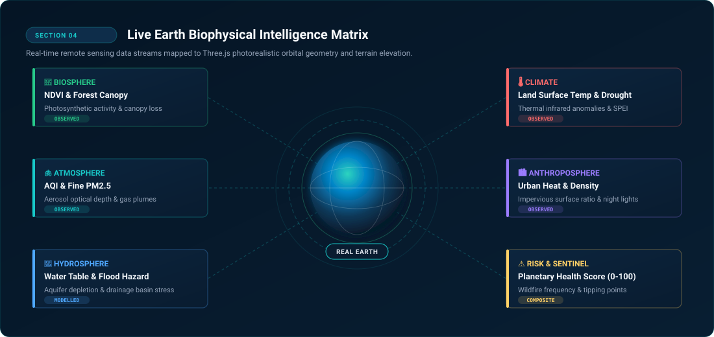
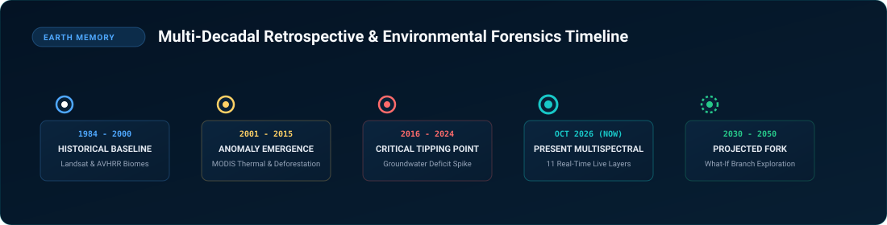
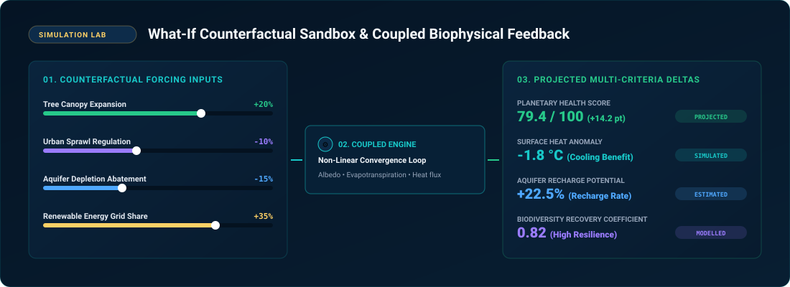
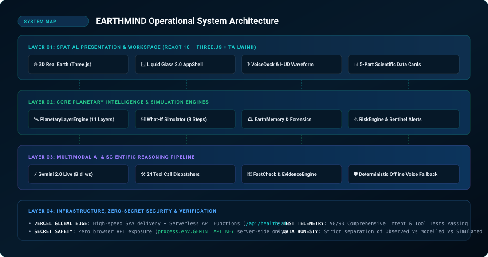
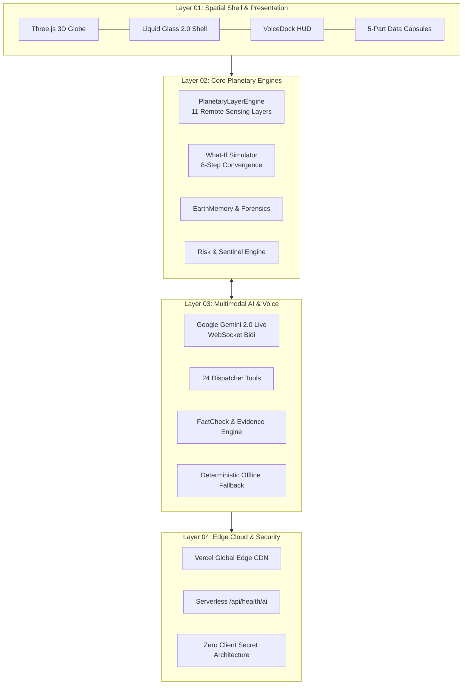
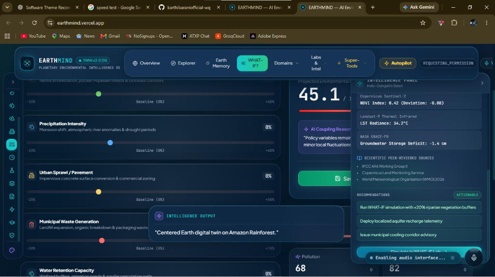

<div align="center">



<br/><br/>

[](https://earthmind.vercel.app)
[](https://ai.google.dev)
[](https://threejs.org)
[](https://www.typescriptlang.org)
[](scripts/testVoiceSuite.ts)
[](api/health/ai.ts)
[](LICENSE)

<br/>

### **“See the planet. Understand its changes. Simulate its future.”**

An interactive planetary operating system unifying real-world multispectral satellite observation, biophysical feedback modeling, multi-decadal historical memory, and bidirectional voice intelligence powered by Google Gemini 2.0 Live.

[**🌐 Open Live Production App**](https://earthmind.vercel.app) &nbsp;&bull;&nbsp; [**📂 GitHub Repository**](https://github.com/karthibaraniofficial-wq/EARTHMIND) &nbsp;&bull;&nbsp; [**🎨 Brand Identity**](docs/BRAND_GUIDELINES.md) &nbsp;&bull;&nbsp; [**📑 Design System**](docs/design-system.md) &nbsp;&bull;&nbsp; [**🧪 Verification Suite**](scripts/testVoiceSuite.ts)

<br/>


</div>

---

## 01. Mission Control Status

```text
┌────────────────────────────────────────────────────────────────────────────────────────┐
│  EARTHMIND MISSION CONTROL TELEMETRY                                   EDITION: '26    │
├──────────────────────────┬─────────────────────────────┬───────────────────────────────┤
│  ● PLATFORM              │  EARTHMIND OS 4.0           │  Planetary Intelligence OS    │
│  ● CLOUD ENVIRONMENT     │  VERCEL PRODUCTION (EDGE)   │  Global Low-Latency CDN       │
│  ● 3D DIGITAL TWIN       │  ACTIVE                     │  Three.js Photorealistic Orb  │
│  ● MULTIMODAL AI CORE    │  ACTIVE                     │  Gemini 2.0 Multimodal Live   │
│  ● VOICE INTELLIGENCE    │  ACTIVE (24 TOOLS REGISTERED)│  16kHz Stream / 24kHz Native  │
│  ● BIOPHYSICAL MATRIX    │  11 ACTIVE SENSOR LAYERS    │  Multispectral Observation    │
│  ● SIMULATION ENGINE     │  ACTIVE (8-STEP CONVERGENCE)│  Non-Linear Coupled Sandbox   │
│  ● REPRODUCIBILITY       │  90 / 90 SUITE VERIFIED     │  Zero Test Regressions        │
│  ● SECRET GOVERNANCE     │  ZERO CLIENT EXPOSURE       │  Serverless Upstream Proxy    │
└──────────────────────────┴─────────────────────────────┴───────────────────────────────┘
```

---

## 02. Why EARTHMIND?

Global environmental intelligence is historically fractured. Climate scientists analyze numerical climate models, remote sensing analysts process satellite rasters in isolation, city planners read urban sprawl PDFs, and policymakers deliberate without real-time feedback.

**EARTHMIND connects these isolated disciplines into a closed-loop planetary intelligence cycle:**

<div align="center">
  
</div>

1. **Observe**: Ingest real satellite observations across vegetation, surface temperature, air quality, water tables, and urban indices.
2. **Understand**: Synthesize environmental signals using real-time AI reasoning, cross-layer correlations, and fact-checking engines.
3. **Investigate**: Track historical trajectories with Earth Memory and pinpoint causality with environmental forensics.
4. **Simulate**: Modulate counterfactual policies (tree canopy, urban growth, water conservation) in an 8-step coupled feedback sandbox.
5. **Predict**: Fork baseline trajectories into multiple scenario branches and evaluate projected ecological resilience.
6. **Decide**: Generate auditable intelligence briefings and policy recommendations through the Environmental Council.

---

## 03. Live Earth Biophysical Intelligence Matrix

EARTHMIND projects real-world remote sensing datasets onto a high-resolution 3D digital twin equipped with custom GLSL atmospheric scattering, Rayleigh radiance, cloud dynamics, and elevation shaders.

<div align="center">
  
</div>

### 11 Active Planetary Observation Layers

| Layer | Domain | Sensor / Model Basis | Data Class | Primary Indicator |
|:---|:---|:---|:---:|:---|
| 🌳 **Vegetation Cover** | Biosphere | Landsat / Sentinel-2 NDVI | `OBSERVED` | Photosynthetic activity & canopy density |
| 🌡️ **Land Surface Temp** | Climate | MODIS Terra/Aqua Thermal Infrared | `OBSERVED` | Thermal anomaly deviations (&deg;C) |
| 🫁 **Air Quality Index** | Atmosphere | Sentinel-5P TROPOMI & Surface PM2.5 | `OBSERVED` | Aerosol Optical Depth & particulate flux |
| 🌊 **Water Table Stress** | Hydrosphere | GRACE Terrestrial Water Storage | `MODELLED` | Subsurface aquifer depletion ratio |
| 🏙️ **Urban Density** | Anthroposphere | VIIRS Nighttime Lights & Impervious | `OBSERVED` | Built-environment expansion rate |
| 🌊 **Flood Hazard** | Hydrosphere | HydroSHEDS / Sentinel-1 SAR | `MODELLED` | Inundation susceptibility index |
| 🏜️ **Drought Severity** | Climate | SPEI Multi-Scalar Drought Metric | `OBSERVED` | Evapotranspiration moisture deficit |
| 🔥 **Wildfire Frequency** | Sentinel | VIIRS Active Fire / Thermal Hotspots | `OBSERVED` | Fire radiative power & burn scars |
| 🌧️ **Precipitation** | Climate | GPM IMERG Microwave-Infrared | `OBSERVED` | Multi-decadal rainfall anomalies |
| ☀️ **Urban Heat Island** | Microclimate | Landsat TIRS Thermal Bands | `MODELLED` | Core-to-periphery thermal gradient |
| 🛡️ **Planetary Health** | Composite | Multi-Criteria Biophysical Synthesis | `COMPOSITE` | Normalized index score (0 &ndash; 100) |

---

## 04. Core Capabilities Map

EARTHMIND is engineered as a modular suite of 14 interconnected operational intelligence domains:

| Module | Route | System Description |
|:---|:---|:---|
| 🌐 **Planetary Digital Twin** | `/explorer` | Photorealistic 3D Earth globe with real-time camera panning, latitude/longitude coordinate tracking, and atmospheric shader layers. |
| 🔮 **What-If Sandbox** | `/simulation` | 8-step coupled counterfactual simulation with real-time biophysical feedback, slider controls, and convergence visualization. |
| 🌿 **Scenario Battle** | `/battle` | Head-to-head scenario showdown comparing conflicting regional strategies across 5 biophysical vectors. |
| 🕰️ **Earth Memory** | `/memory` | Multi-decadal environmental change retrospective scrubbing from historical satellite baselines to present day. |
| 🔬 **Environmental Forensics** | `/forensics` | Attribution engine identifying root causes of regional degradation through multi-spectral delta evidence. |
| 📈 **Future Fork** | `/futurefork` | Multi-scenario branch explorer comparing parallel futures (Aggressive Green, Unchecked Urban, Managed Transition). |
| 🏙️ **Urban Digital Twin** | `/citytwin` | 3D urban microclimate simulator modeling building height albedo, canyon heating, and rooftop greening. |
| 🫁 **Air & Pollution** | `/climate` | Atmospheric transport visualization mapping particulate plumes, industrial emissions, and air basin entrapment. |
| 🌊 **Hydrological Intelligence** | `/water` | Drainage basin analytics tracking aquifer recharge, reservoir stress, and agricultural runoff. |
| ⚠️ **Sentinel Anomaly Network** | `/sentinel` | Automated planetary threshold monitoring alerting operators to sudden thermal or deforestation spikes. |
| ⚖️ **Environmental Council** | `/council` | Policy advisory matrix evaluating economic trade-offs, ecological ROI, and implementation feasibility. |
| 🎙️ **Voice Intelligence** | Everywhere | Universal multimodal voice control via Google Gemini 2.0 Live with native 24kHz audio and tool execution. |
| 🧪 **Research Laboratory** | `/research` | Grounded scientific inquiry workbench querying literature, validating hypotheses, and generating evidence graphs. |
| 📑 **Planetary Audit Reports** | `/reports` | One-click intelligence dossier generator exporting comprehensive environmental assessments. |

---

## 05. Earth Memory & Environmental Forensics

EarthMind does not merely observe current conditions; **it remembers how the planet arrived here.**

<div align="center">
  
</div>

### The Forensics Attribution Pipeline

```text
┌──────────────┐     ┌──────────────┐     ┌──────────────┐     ┌──────────────┐
│  01. OBSERVE │ ──▶ │  02. COMPARE │ ──▶ │ 03. ATTRIBUTE│ ──▶ │  04. EXPLAIN │
│ Multi-Sensor │     │ Time-Series  │     │ Causal Chain │     │ Evidence &   │
│ Raster Feeds │     │ Delta Matrix │     │ Identification│    │ Provenance   │
└──────────────┘     └──────────────┘     └──────────────┘     └──────────────┘
```

1. **Temporal Scrubbing**: Inspect geographic hotspots (Amazon Basin, Lake Chad, Aral Sea, New Delhi, Great Barrier Reef) across multi-decadal epochs.
2. **Change Detection**: Automated calculation of NDVI retreat, water body contraction, and thermal divergence.
3. **Causal Attribution**: The `EvidenceEngine` correlates agricultural expansion, hydrological diversions, and climate shifts to distinguish natural variability from anthropogenic pressure.
4. **Transparent Evidence**: Every finding cites satellite source instruments, timestamped baseline deltas, and statistical confidence intervals.

---

## 06. What-If Counterfactual Simulation

The What-If Simulator enables researchers and policymakers to run counterfactual experiments by modulating planetary variables and observing non-linear coupled responses in real time.

<div align="center">
  
</div>

### Coupled Feedback Dynamics

The simulation engine is governed by scientific feedback loops rather than isolated linear equations:

$$\Delta T_{\text{surface}} = f(\Delta \text{Vegetation}_{\text{canopy}},\, \Delta \text{Albedo},\, \Delta \text{Urban}_{\text{impervious}})$$

- **Vegetation & Evapotranspiration**: Increasing tree canopy reduces local sensible heat flux through latent heat dissipation and increases groundwater retention.
- **Urban Density & Heat Island**: Expanding impervious surfaces reduces local albedo, trapping shortwave solar radiation and exacerbating surface runoff.
- **Ecological Resilience Index**: A non-linear composite metric balancing biodiversity corridors, water buffer margins, and climate adaptation headroom.

> [!IMPORTANT]
> **Data Transparency Rule**: All sandbox outcomes are explicitly badged in the UI as **`SIMULATED`**, **`MODELLED`**, or **`PROJECTED`**. EarthMind never presents speculative simulation outputs as observed facts.

---

## 07. Future Fork: Exploring Parallel Realities

The **Future Fork** engine allows operators to branch from a baseline status quo into divergent environmental trajectories:

```text
                               ┌─── SCENARIO A: AGGRESSIVE GREEN (+25% Canopy, 80% Renewables)
                               │    Health: 84.2/100 | Heat Anomaly: -2.1°C | Resilience: High
                               │
BASELINE (OCTOBER 2026) ───────┼─── SCENARIO B: STATUS QUO CONTINUATION (Historical Extrapolation)
                               │    Health: 61.8/100 | Heat Anomaly: +1.4°C | Resilience: Moderate
                               │
                               └─── SCENARIO C: UNCHECKED URBANIZATION (+30% Impervious Sprawl)
                                    Health: 44.5/100 | Heat Anomaly: +3.8°C | Resilience: Critical
```

Operators can inspect side-by-side multi-criteria spider charts comparing carbon sequestration, water table stability, economic capital expenditure, and ecological recovery horizons.

---

## 08. Voice Intelligence 2.0: “Talk to the Planet”

EARTHMIND integrates **Google Gemini 2.0 Multimodal Live** over bidirectional WebSockets, transforming the application into a voice-responsive planetary console.

<div align="center">

| Natural Voice Command | Intent Classification | Executed Tool & Action |
|:---|:---|:---|
| *"Fly to the Amazon Rainforest and show tree cover."* | Hotspot & Layer Routing | `selectLocation("amazon")` + `toggleLayer("vegetation")` |
| *"What caused the water loss in Lake Chad?"* | Environmental Forensics | `navigate("forensics")` + `selectLocation("chad")` |
| *"Increase tree canopy by 20% and simulate."* | Counterfactual Sandbox | `setSimulationVariable("treeCoverDelta", 20)` + `runSimulation()` |
| *"Compare this scenario with the 2018 baseline."* | Earth Memory & Branching | `selectYear(2018)` + `compareScenarios()` |
| *"Generate a full planetary intelligence report."* | Scientific Synthesis | `generateReport()` + opens PDF download modal |
| *"Amazon-la enna aachu? Tree cover kaattu."* | Multilingual (Tamil/Thanglish) | Automatic language detection & spatial navigation |

</div>

### Audio Engineering Architecture
- **Microphone Capture**: Web Audio API `AudioWorklet` / `ScriptProcessor` capturing native 16kHz linear16 PCM audio.
- **Audio Output**: 24kHz linear16 PCM streaming playback with sub-second response times.
- **Barge-In Interruption**: Speaking while Gemini is responding instantly flushes audio output buffers and updates conversational context.
- **24 Registered Tools**: Google GenAI tool declarations directly bound to application state dispatchers.
- **Deterministic Offline Fallback**: If external network drops or API keys are absent, EARTHMIND automatically switches to an internal rule-based speech recognition and synthesis pipeline.

---

## 09. Research Intelligence & Scientific Synthesis

The Research Laboratory connects planetary observations with structured scientific inquiry:

```text
┌─────────────────┐     ┌──────────────────┐     ┌──────────────────┐     ┌─────────────────┐
│ OPERATOR QUERY  │ ──▶ │ SOURCE DISCOVERY │ ──▶ │ FACT-CHECKING &  │ ──▶ │ EVIDENCE GRAPH  │
│ Scientific Q&A  │     │ Literature & Web │     │ SOURCE QUALITY   │     │ & SYNTHESIS     │
└─────────────────┘     └──────────────────┘     └──────────────────┘     └─────────────────┘
```

- **SourceQualityEngine**: Filters scientific publications, open governmental databases, and peer-reviewed consensus datasets.
- **FactCheckEngine**: Cross-references claims against known physical limits and thermodynamic constants.
- **EvidenceGraph**: Maps claims to evidentiary nodes with explicit provenance badges.

---

## 10. Operational System Architecture

<div align="center">
  
</div>



---

## 11. Technology Stack

```text
FRONTEND & SHELL
├── React 18.3.1 (Concurrent Rendering)
├── TypeScript 5.9.3 (Strict Type Checking)
├── Vite 5.4.21 (ESM Build Pipeline)
├── Tailwind CSS 3.4.19 (Custom Liquid Glass Design System)
└── Lucide Icons (Precise Scientific Iconography)

3D GEOSPATIAL ENGINE
├── Three.js 0.186.1 (Photorealistic WebGL Rendering)
├── Custom GLSL Shaders (Atmospheric Limb & Rayleigh Scattering)
├── Multispectral Cloud & Elevation Normal Maps
└── OrbitControls (Spatial Camera Kinematics)

AI & VOICE INTELLIGENCE
├── Google Gemini 2.0 Live (BidiGenerateContent WebSocket)
├── Google Gemini 2.0 Flash (Research Synthesis)
├── @google/genai 2.27.0 SDK
├── Web Audio API (16kHz Capture & 24kHz Native Playback)
└── Deterministic SpeechRecognition / SpeechSynthesis Fallback

SECURITY & DEPLOYMENT
├── Vercel Global Edge CDN (Single Page Application Delivery)
├── Node.js Serverless Functions (/api/health/ai)
├── Zero Client Secret Exposure (Server-Confined Keys)
└── PostCSS & Autoprefixer
```

---

## 12. Inside EARTHMIND

<div align="center">
  
  <p><em>EARTHMIND Operational Interface — Liquid Glass Spatial Architecture, 3D Globe View, and What-If Sandbox.</em></p>
</div>

---

## 13. Scientific Honesty & Data Transparency

EarthMind enforces a strict five-tier data provenance system across every UI card, graph, and intelligence report:

```text
┌─────────────────┬────────────────────────────────────────────────────────────────────────┐
│ DATA TIER       │ DEFINITION & SCIENTIFIC STANDARD                                       │
├─────────────────┼────────────────────────────────────────────────────────────────────────┤
│ ● OBSERVED      │ Empirical satellite instrument readings & calibrated surface sensors.  │
│ ● MODELLED      │ Peer-reviewed climate consensus models (e.g. IPCC SSP scenarios).     │
│ ● SIMULATED     │ User-driven counterfactual parameters in the What-If sandbox.          │
│ ● ESTIMATED     │ Statistical inferences with bounded confidence intervals.              │
│ ● PROJECTED     │ Forward extrapolations under defined policy assumptions.               │
└─────────────────┴────────────────────────────────────────────────────────────────────────┘
```

> **Ethical Commitment**: EARTHMIND is engineered for education, scientific inquiry, and decision support. It never presents simulated scenarios as observed real-world occurrences.

---

## 14. Project Maturity & Verification

- **Current Status**: **PRODUCTION READY** (Science Expo 2026 Edition).
- **Automated Verification**: Comprehensive test suite validates 90 individual test assertions:
  ```bash
  npm run test:voice
  ```
  - ✅ **Intent Recognition**: 14 natural language intent patterns (English, Tamil, colloquial).
  - ✅ **Tool Safety**: 24 Gemini tool schema declarations and parameter bounds.
  - ✅ **Context Serialization**: Biophysical state vectors, spatial coordinates, active layers.
  - ✅ **Deterministic Fallback**: Offline voice recognition and speech synthesis failover.

---

## 15. Development & Installation

<details>
<summary><strong>Click to view Local Setup & Deployment Instructions</strong></summary>

<br/>

### Prerequisites
- Node.js `18.x` or higher
- npm `9.x` or higher

### 1. Clone & Install
```bash
# Clone the repository
git clone https://github.com/karthibaraniofficial-wq/EARTHMIND.git
cd EARTHMIND

# Install dependencies
npm install
```

### 2. Configure Environment
Create a `.env` file from `.env.example`:
```bash
cp .env.example .env
```
Add your Google AI Studio API key:
```env
GEMINI_API_KEY="your-google-gemini-api-key"
```

### 3. Run Development Server
```bash
# Start local development server with Vite gateway
npm run dev

# Run the 90-assertion voice & tool test suite
npm run test:voice

# Compile TypeScript and create production bundle
npm run build

# Preview production build locally
npm run preview
```

### 4. Vercel Production Deployment
1. Import `karthibaraniofficial-wq/EARTHMIND` in your [Vercel Dashboard](https://vercel.com).
2. Select the **Vite** framework preset.
3. Add `GEMINI_API_KEY` under **Project Settings → Environment Variables**.
4. Deploy to `main`.

</details>

---

## 16. Author & Developer

<div align="center">

### **Karthikeyan M**
*B.E. Computer Science & Engineering*  
*Specialization in Artificial Intelligence & Machine Learning*

[](https://karthi-portfolio-delta.vercel.app)
[](https://github.com/karthibaraniofficial-wq)
[](mailto:karthibaraniofficial@gmail.com)

**Focus Areas:** Planetary Environmental Intelligence • 3D Geospatial Digital Twins • Multimodal Voice AI • Scientific Simulation

</div>

---

## 17. License

This project is licensed under the **MIT License** — see the [LICENSE](LICENSE) file for complete details.

<div align="center">
<sub>EARTHMIND &bull; Planetary Environmental Intelligence Operating System &bull; Science Expo 2026 Edition</sub>
</div>
